[](https://doi.org/10.5281/zenodo.14183686)

# GCMD _Enhanced_ (GCMD-E)
The Global Change Master Directory ([GCMD](https://gcmd.earthdata.nasa.gov/)) is a set of keywords developed by NASA to standardize metadata terminology for data discovery [^7][^8]. GCMD has been developed and curated since the late 80's and now serves to tag and index thousands of data sets [^4] and is openly available for reuse as it is in the public domain ([CC0 license](https://www.earthdata.nasa.gov/data/tools/idn/gcmd-keyword-viewer)).

While investigating GCMD concepts for a separate project [^6], inconsistencies in the vocabularies surfaced. For example, consider the concept ```STRATIGRAPHIC SEQUENCE```.  In GCMD this concept has 13 separate representations, as noted by the 13 unique concept IDs in figure 1.  While all 13 concepts are tethered to a natural language definition, several definitions are exactly the same (verbatim) and others are similar enough where distinguishing differentae between them is murky, at best.

This repository provides the first iteration in providing relationships between related terms for the [science keywords](https://gcmd.earthdata.nasa.gov/static/kms/) category. The current release inserts `skos:exactMatch` relationships between concepts having the exact same natural language definition (verbatim), or very near that (~98% similarity), using automated text comparison tools and a heap of manual effort. Figure 2 provides an illustration of where the predicates have been inserted using the concepts already depicted figure 1.

The _enhanced_ science keyword terms are available to download as a turtle file (ttl) in this repository ([GCMD_v19.9_enhanced.ttl](GCMD_v19.9_enhanced.ttl)). They have also been uploaded to ESIP's Community Ontology Repository ([COR](http://cor.esipfed.org)).


Figure 1. The concept ```STRATIGRAPHIC SEQUENCE``` as found in GCMD.

```mermaid
flowchart RL
stratSeq("<font color=white>STRATIGRAPHIC
SEQUENCE")
c1[<font color=black><a href='https://gcmd.earthdata.nasa.gov/kms/concept/42b5ae5b-90d5-44f0-b331-6c22cdd45c3f'>42b5ae5b-90d5-44f0-b331-6c22cdd45c3f</a>]

c2[<font color=black><a href='https://gcmd.earthdata.nasa.gov/kms/concept/4722fc1e-f93f-4aa1-854a-2b8a82920008'>4722fc1e-f93f-4aa1-854a-2b8a82920008</a>]
c3[<font color=black><a href='https://gcmd.earthdata.nasa.gov/kms/concept/ac45c059-9555-45ee-ad20-d58514578f1e'>ac45c059-9555-45ee-ad20-d58514578f1e</a>]
c4[<font color=black><a href='https://gcmd.earthdata.nasa.gov/kms/concept/a7b04d56-2a44-4a94-8d94-1911a7110f9d'>a7b04d56-2a44-4a94-8d94-1911a7110f9d</a>]

c5[<font color=black><a href='https://gcmd.earthdata.nasa.gov/kms/concept/7fa9d5ef-690e-4daf-8503-363b6b1cb6e4'>7fa9d5ef-690e-4daf-8503-363b6b1cb6e4</a>]
c6[<font color=black><a href='https://gcmd.earthdata.nasa.gov/kms/concept/d845886d-0c44-4505-b5b9-d3fcd819208e'>d845886d-0c44-4505-b5b9-d3fcd819208e</a>]
c7[<font color=black><a href='https://gcmd.earthdata.nasa.gov/kms/concept/417a6538-f89e-4f73-a89a-c2e5d2cd7667'>417a6538-f89e-4f73-a89a-c2e5d2cd7667</a>]

c8[<font color=black><a href='https://gcmd.earthdata.nasa.gov/kms/concept/a08cce11-9407-4b1f-b13e-0df87da03612'>a08cce11-9407-4b1f-b13e-0df87da03612</a>]
c9[<font color=black><a href='https://gcmd.earthdata.nasa.gov/kms/concept/870803f5-8bbc-4e39-8372-ce21b0decb75'>870803f5-8bbc-4e39-8372-ce21b0decb75</a>]
c10[<font color=black><a href='https://gcmd.earthdata.nasa.gov/kms/concept/e9c6d45a-787e-4099-bbf9-03d377cdb8d5'>e9c6d45a-787e-4099-bbf9-03d377cdb8d5</a>]

c11[<font color=black><a href='https://gcmd.earthdata.nasa.gov/kms/concept/c25fef4a-f346-4831-8015-7853886c4fc7'>c25fef4a-f346-4831-8015-7853886c4fc7</a>]

c12[<font color=black><a href='https://gcmd.earthdata.nasa.gov/kms/concept/41b7293f-7f20-40ab-8bf7-b211c68146b9'>41b7293f-7f20-40ab-8bf7-b211c68146b9</a>]
c13[<font color=black><a href='https://gcmd.earthdata.nasa.gov/kms/concept/efe175a0-100b-404b-a702-2e179bee034a'>efe175a0-100b-404b-a702-2e179bee034a</a>]

def1("<font color=black>A chronological succession of sedimentary rocks from older to younger above;
essentially without interruption.")

def2("<font color=black>A set of deposited sedimentary beds that reflects the depositional
environment of those beds and the geologic history of a region.
A stratigraphic sequence is a chronologic succession of sedimentary rocks
from older below to younger above without interruption.")

def3("<font color=black>A set of deposited sedimentary beds that reflects the depositional 
environment of those beds and the geologic history of a region. A stratigraphic
sequence is a chronologic succession of sedimentary rocks from older below
to younger above without interruption.")

def4("<font color=black>A chronological succession of sedimentary rocks.")

def5("<font color=black>A set of deposited sedimentary beds that reflects the depositional environment.")

def6("<font color=black>A set of deposited sedimentary beds that reflects the depositional
environment of those beds and the geologic history of a region.")

cn1("<font color=black>citation: Dictionary of Geologic Terms, AGI, 1984")

cn2("<font color=black>Definition updated (2017); citation: Adapted from: Press, F. and Siever, R.
1986. Earth. W.H. Freeman and Company.  Fourth Edition. p. 645.
also:  Jackson, J.A., ed. 1997. Glossary of Geology,
4th edition. American Geological  Institute.;\n\n

*note* previoius definition: A chronological succession of sedimentary rocks.")

cn3("<font color=black>Defiinition updated (2017) citation: Adapted from: Press, F. and Siever, R. 1986.
Earth. W.H. Freeman and Company. Fourth Edition. p. 645.")

c1 --"skos:prefLabel"--> stratSeq
c2 --"skos:prefLabel"--> stratSeq
c3 --"skos:prefLabel"--> stratSeq
c4 --"skos:prefLabel"--> stratSeq
c5 --"skos:prefLabel"--> stratSeq
c6 --"skos:prefLabel"--> stratSeq
c7 --"skos:prefLabel"--> stratSeq
c8 --"skos:prefLabel"--> stratSeq 
c9 --"skos:prefLabel"--> stratSeq
c10 --"skos:prefLabel"--> stratSeq
c11 --"skos:prefLabel"--> stratSeq
c12 --"skos:prefLabel"--> stratSeq
c13 --"skos:prefLabel"--> stratSeq

def1 --"skos:definition"--> c1
cn1 --"skos:changeNote"--> c1

def2 --"skos:definition"--> c2
def2 --"skos:definition"--> c3
def2 --"skos:definition"--> c4
cn2 --"skos:changeNote"--> c4

def3 --"skos:definition"--> c5
def3 --"skos:definition"--> c6
def3 --"skos:definition"--> c7

def4 --"skos:definition"--> c8
def4 --"skos:definition"--> c9
def4 --"skos:definition"--> c10

def5 --"skos:definition"--> c11

def6 --"skos:definition"--> c12
def6 --"skos:definition"--> c13
cn3 --"skos:changeNote"--> c13

classDef def fill:#eeeeee,stroke:#333,stroke-width:3px
classDef cn fill:#e3edf6,stroke:#333,stroke-width:3px
classDef strat fill:#000000,stroke:#333,stroke-width:3px
classDef group1 fill:#33ffbd,stroke:#333,stroke-width:3px
classDef group2 fill:#ffe599,stroke:#333,stroke-width:3px
classDef group3 fill:#b6d7a8,stroke:#333,stroke-width:3px
classDef group4 fill:#b4a7d6,stroke:#333,stroke-width:3px
classDef group5 fill:#f9cb9c,stroke:#333,stroke-width:3px
classDef group6 fill:#ff8181,stroke:#333,stroke-width:3px

class def1,def2,def3,def4,def5,def6 def
class cn1,cn2,cn3 cn
class stratSeq strat
class c1 group1
class c2,c3,c4 group2
class c5,c6,c7 group3
class c8,c9,c10 group4
class c11 group5
class c12,c13 group6
```



Figure 2. Adding `skos:exactMatch` relationships to concepts with syntactically equivalent definitions; illustrated using the ```STRATIGRAPHIC SEQUENCE``` concept from GCMD per figure 1.

```mermaid
flowchart RL
stratSeq("<font color=white>STRATIGRAPHIC
SEQUENCE")
c1[<font color=black><a href='https://gcmd.earthdata.nasa.gov/kms/concept/42b5ae5b-90d5-44f0-b331-6c22cdd45c3f'>42b5ae5b-90d5-44f0-b331-6c22cdd45c3f</a>]

c2[<font color=black><a href='https://gcmd.earthdata.nasa.gov/kms/concept/4722fc1e-f93f-4aa1-854a-2b8a82920008'>4722fc1e-f93f-4aa1-854a-2b8a82920008</a>]
c3[<font color=black><a href='https://gcmd.earthdata.nasa.gov/kms/concept/ac45c059-9555-45ee-ad20-d58514578f1e'>ac45c059-9555-45ee-ad20-d58514578f1e</a>]
c4[<font color=black><a href='https://gcmd.earthdata.nasa.gov/kms/concept/a7b04d56-2a44-4a94-8d94-1911a7110f9d'>a7b04d56-2a44-4a94-8d94-1911a7110f9d</a>]

c5[<font color=black><a href='https://gcmd.earthdata.nasa.gov/kms/concept/7fa9d5ef-690e-4daf-8503-363b6b1cb6e4'>7fa9d5ef-690e-4daf-8503-363b6b1cb6e4</a>]
c6[<font color=black><a href='https://gcmd.earthdata.nasa.gov/kms/concept/d845886d-0c44-4505-b5b9-d3fcd819208e'>d845886d-0c44-4505-b5b9-d3fcd819208e</a>]
c7[<font color=black><a href='https://gcmd.earthdata.nasa.gov/kms/concept/417a6538-f89e-4f73-a89a-c2e5d2cd7667'>417a6538-f89e-4f73-a89a-c2e5d2cd7667</a>]

c8[<font color=black><a href='https://gcmd.earthdata.nasa.gov/kms/concept/a08cce11-9407-4b1f-b13e-0df87da03612'>a08cce11-9407-4b1f-b13e-0df87da03612</a>]
c9[<font color=black><a href='https://gcmd.earthdata.nasa.gov/kms/concept/870803f5-8bbc-4e39-8372-ce21b0decb75'>870803f5-8bbc-4e39-8372-ce21b0decb75</a>]
c10[<font color=black><a href='https://gcmd.earthdata.nasa.gov/kms/concept/e9c6d45a-787e-4099-bbf9-03d377cdb8d5'>e9c6d45a-787e-4099-bbf9-03d377cdb8d5</a>]

c11[<font color=black><a href='https://gcmd.earthdata.nasa.gov/kms/concept/c25fef4a-f346-4831-8015-7853886c4fc7'>c25fef4a-f346-4831-8015-7853886c4fc7</a>]

c12[<font color=black><a href='https://gcmd.earthdata.nasa.gov/kms/concept/41b7293f-7f20-40ab-8bf7-b211c68146b9'>41b7293f-7f20-40ab-8bf7-b211c68146b9</a>]
c13[<font color=black><a href='https://gcmd.earthdata.nasa.gov/kms/concept/efe175a0-100b-404b-a702-2e179bee034a'>efe175a0-100b-404b-a702-2e179bee034a</a>]

def1("<font color=black>A chronological succession of sedimentary rocks from older to younger above;
essentially without interruption.")

def2("<font color=black>A set of deposited sedimentary beds that reflects the depositional
environment of those beds and the geologic history of a region.
A stratigraphic sequence is a chronologic succession of sedimentary rocks
from older below to younger above without interruption.")

def3("<font color=black>A set of deposited sedimentary beds that reflects the depositional 
environment of those beds and the geologic history of a region. A stratigraphic
sequence is a chronologic succession of sedimentary rocks from older below
to younger above without interruption.")

def4("<font color=black>A chronological succession of sedimentary rocks.")

def5("<font color=black>A set of deposited sedimentary beds that reflects the depositional environment.")

def6("<font color=black>A set of deposited sedimentary beds that reflects the depositional
environment of those beds and the geologic history of a region.")

cn1("<font color=black>citation: Dictionary of Geologic Terms, AGI, 1984")

cn2("<font color=black>Definition updated (2017); citation: Adapted from: Press, F. and Siever, R.
1986. Earth. W.H. Freeman and Company.  Fourth Edition. p. 645.
also:  Jackson, J.A., ed. 1997. Glossary of Geology,
4th edition. American Geological  Institute.;\n\n

*note* previoius definition: A chronological succession of sedimentary rocks.")

cn3("<font color=black>Defiinition updated (2017) citation: Adapted from: Press, F. and Siever, R. 1986.
Earth. W.H. Freeman and Company. Fourth Edition. p. 645.")

c1 --"skos:prefLabel"--> stratSeq
c2 --"skos:prefLabel"--> stratSeq
c3 --"skos:prefLabel"--> stratSeq
c4 --"skos:prefLabel"--> stratSeq
c5 --"skos:prefLabel"--> stratSeq
c6 --"skos:prefLabel"--> stratSeq
c7 --"skos:prefLabel"--> stratSeq
c8 --"skos:prefLabel"--> stratSeq 
c9 --"skos:prefLabel"--> stratSeq
c10 --"skos:prefLabel"--> stratSeq
c11 --"skos:prefLabel"--> stratSeq
c12 --"skos:prefLabel"--> stratSeq
c13 --"skos:prefLabel"--> stratSeq

def1 --"skos:definition"--> c1
cn1 --"skos:changeNote"--> c1

c2 <--"skos:exactMatch"--> c3
c3 <--"skos:exactMatch"--> c4
def2 --"skos:definition"--> c2
def2 --"skos:definition"--> c3
def2 --"skos:definition"--> c4
cn2 --"skos:scopeNote"--> c2

c5 <--"skos:exactMatch"--> c6
c6 <--"skos:exactMatch"--> c7
def3 --"skos:definition"--> c5
def3 --"skos:definition"--> c6
def3 --"skos:definition"--> c7

c8 <--"skos:exactMatch"--> c9
c9 <--"skos:exactMatch"--> c10
def4 --"skos:definition"--> c8
def4 --"skos:definition"--> c9
def4 --"skos:definition"--> c10

def5 --"skos:definition"--> c11

c12 <--"skos:exactMatch"--> c13
def6 --"skos:definition"--> c12
def6 --"skos:definition"--> c13
cn3 --"skos:changeNote"--> c13

classDef def fill:#eeeeee,stroke:#333,stroke-width:3px
classDef cn fill:#e3edf6,stroke:#333,stroke-width:3px
classDef strat fill:#000000,stroke:#333,stroke-width:3px
classDef group1 fill:#33ffbd,stroke:#333,stroke-width:3px
classDef group2 fill:#ffe599,stroke:#333,stroke-width:3px
classDef group3 fill:#b6d7a8,stroke:#333,stroke-width:3px
classDef group4 fill:#b4a7d6,stroke:#333,stroke-width:3px
classDef group5 fill:#f9cb9c,stroke:#333,stroke-width:3px
classDef group6 fill:#ff8181,stroke:#333,stroke-width:3px

class def1,def2,def3,def4,def5,def6 def
class cn1,cn2,cn3 cn
class stratSeq strat
class c1 group1
class c2,c3,c4 group2
class c5,c6,c7 group3
class c8,c9,c10 group4
class c11 group5
class c12,c13 group6
```


[^1]: Raskin R (2003) [Semantic Web for Earth and Environmental Terminology (SWEET)](https://esto.nasa.gov/conferences/estc2003/papers/A7P2(Raskin).pdf). In ‘NASA Earth Science Technology Conference (ESTC)’, University of Maryland. 4.
[^2]: Raskin RG, Pan MJ (2003) [Ontology development in the Semantic Web for Earth and Environmental Terminology (SWEET)](https://gsa.confex.com/gsa/2003AM/webprogram/Paper67551.html). Geological Society of America Abstracts with Programs 35, 368.
[^3]: Raskin RG, Pan MJ (2005) Knowledge Representation in the Semantic Web for Earth and Environmental Terminology (SWEET). Computers & Geosciences 31, 1119–1125. doi:[10.1016/j.cageo.2004.12.004](https://doi.org/10.1016/j.cageo.2004.12.004).
[^4]: Parsons MA, Duerr R, Godøy Ø (2023) The evolution of a geoscience standard: An instructive tale of science keyword development and adoption. Geoscience Frontiers 14, 101400. doi:[10.1016/j.gsf.2022.101400](https://doi.org/10.1016/j.gsf.2022.101400).
[^5]: McGibbney LJ, Whitehead B, Rueda-Velásquez CA, Duerr R, Keil JM, Berg-Cross G, Rose K, dr-shorthair, smrgeoinfo, graybeal, pbuttigieg, charlesvardeman, ashepherd, esip, nicholascar, ignazio1977, cmungall, esip-lab, bradh (2022) Semantic Web for Earth and Environmental Terminology (SWEET). http://sweetontology.net.
[^6]: Duerr R, Buttigieg PL, Cross GB, Blumberg KL, Whitehead B, Wiegand N, Rose K (2024) Harmonizing GCW Cryosphere Vocabularies with ENVO and SWEET. Towards a General Model for Semantic Harmonization. Data Science Journal 23, 1-22. doi:[10.5334/dsj-2024-026](https://doi.org/10.5334/dsj-2024-026).
[^7]: GCMD (2024) Global Change Master Directory (GCMD) Keywords. https://forum.earthdata.nasa.gov/app.php/tag/GCMD+Keywords.
[^8]: Blumenfeld J (2021) The Global Change Master Directory: Data, Services, and Tools Serving the International Science Community. https://www.earthdata.nasa.gov/news/feature-articles/global-change-master-directory-data-services-tools-serving-international.
